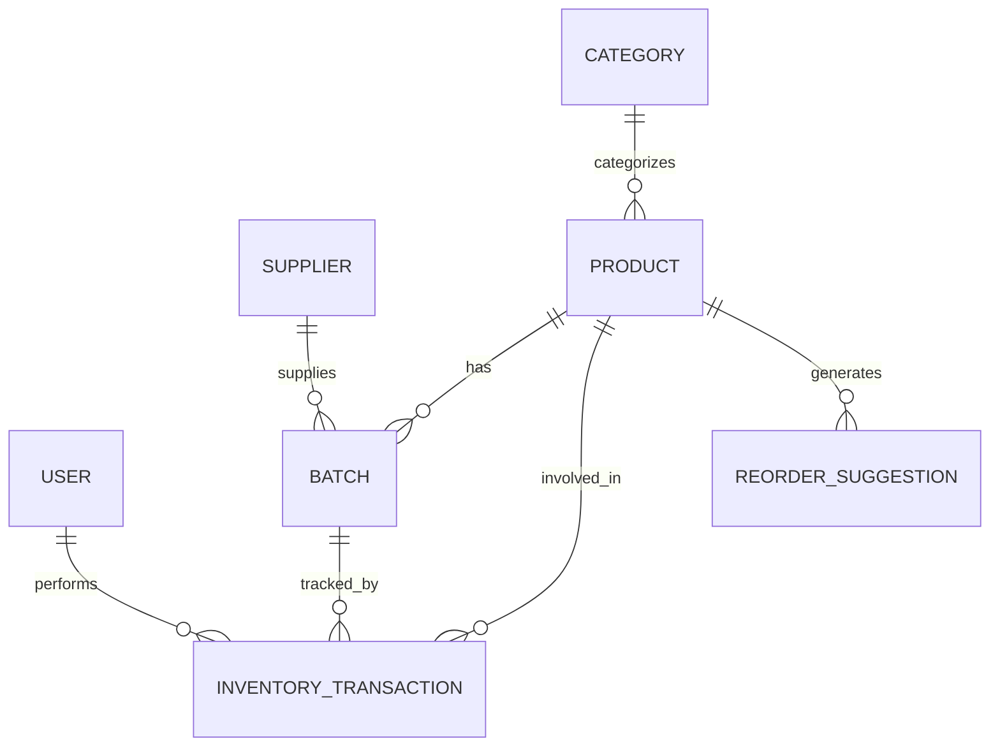

# Database Design

The database is normalized to 3NF to ensure strict data integrity. 

## Entity Relationship Diagram

## Key Tables & Design Decisions

### `batches`
- `batch_number` (Unique): Identifier from the manufacturer.
- `expiry_date` (Date): Critical for the FEFO engine.
- `available_quantity` (Int): The live stock count.
- `version` (Int): Used by Hibernate for Optimistic Locking to prevent concurrent overwrite anomalies.

### `inventory_transactions`
- This is an **Append-Only** ledger table. 
- Records are never updated or deleted. If a mistake is made, a compensating transaction (e.g., `ADJUST` or `RETURN`) must be inserted.
- `type` Enum: `IN`, `OUT`, `ADJUST`, `RETURN`.

### Soft Deletes
The `users`, `products`, and `suppliers` tables feature an `active` boolean flag. We do not physically delete these records, as doing so would violate foreign key constraints on the `inventory_transactions` table, destroying historical audit trails.
